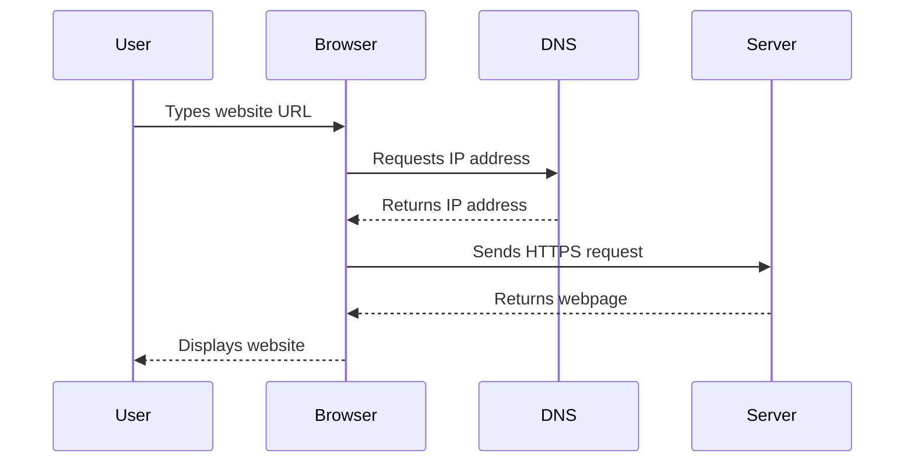
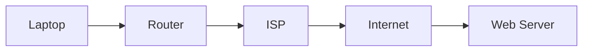

# Network Flow Diagrams

## Website loading flow

```mermaid
sequenceDiagram
    participant User
    participant Browser
    participant DNS
    participant Server

    User->>Browser: Types website URL
    Browser->>DNS: Requests IP address
    DNS-->>Browser: Returns IP address
    Browser->>Server: Sends HTTPS request
    Server-->>Browser: Returns webpage
    Browser-->>User: Displays website
```

## Local network to internet

```mermaid
flowchart LR
    A[Laptop] --> B[Router]
    B --> C[ISP]
    C --> D[Internet]
    D --> E[Web Server]
```

## Device communication using ports

```mermaid
flowchart LR
    A[Client Device] -->|Request to port 443| B[Web Server]
    B -->|HTTPS Response| A
```
