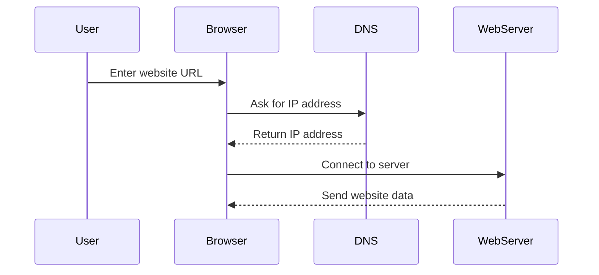

# DNS Basics

## What is DNS?

DNS stands for Domain Name System. It converts human-readable domain names into IP addresses.

Example:

```text
example.com -> 93.184.216.34
```

Without DNS, users would need to remember IP addresses instead of website names.

## Why DNS matters

When you type a website name into a browser, DNS helps find the correct server on the internet.

## Basic DNS flow



## Common DNS record types

| Record | Purpose |
|---|---|
| A | Maps a domain to an IPv4 address |
| AAAA | Maps a domain to an IPv6 address |
| CNAME | Creates an alias for another domain |
| MX | Specifies mail servers |
| TXT | Stores text information, often for verification or security |
| NS | Specifies authoritative name servers |

## DNS cache

Devices and browsers often store DNS results temporarily. This is called DNS caching. It makes browsing faster but can sometimes cause outdated results.

## Common DNS issues

- Website name does not resolve
- DNS server is unreachable
- Cached DNS record is outdated
- Incorrect DNS configuration

## Troubleshooting DNS

Useful commands:

```bash
nslookup example.com
```

```bash
dig example.com
```

```bash
ipconfig /flushdns
```

## Quick summary

- DNS converts domain names into IP addresses.
- DNS records define how domains behave.
- DNS issues can stop websites from loading even when internet access is working.
