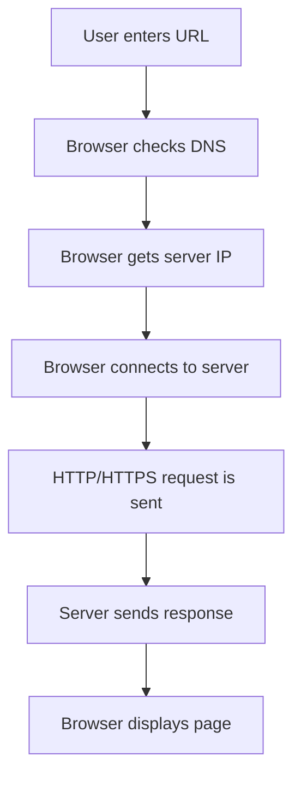

# HTTP and HTTPS Basics

## What is HTTP?

HTTP stands for Hypertext Transfer Protocol. It is used by browsers and web servers to exchange web content.

Example:

```text
http://example.com
```

## What is HTTPS?

HTTPS is the secure version of HTTP. It uses encryption to protect data between the browser and the server.

Example:

```text
https://example.com
```

## HTTP vs HTTPS

| Feature | HTTP | HTTPS |
|---|---|---|
| Encryption | No | Yes |
| Default port | 80 | 443 |
| Security | Less secure | More secure |
| Used for login/payment pages | Not recommended | Recommended |

## What happens when you visit a website?



## Common HTTP methods

| Method | Purpose |
|---|---|
| GET | Request data |
| POST | Send data |
| PUT | Update data |
| DELETE | Delete data |
| PATCH | Partially update data |

## Common HTTP status codes

| Code | Meaning |
|---|---|
| 200 | OK |
| 301 | Moved permanently |
| 302 | Temporary redirect |
| 400 | Bad request |
| 401 | Unauthorized |
| 403 | Forbidden |
| 404 | Not found |
| 500 | Internal server error |

## Quick summary

- HTTP is used for web communication.
- HTTPS adds encryption and security.
- Browsers use requests and servers return responses.
- Status codes help explain the result of a request.
