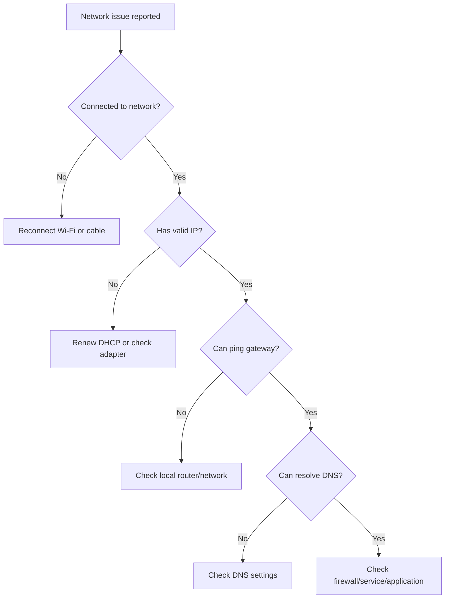

# Basic Network Troubleshooting

## Troubleshooting mindset

When a network issue happens, check step by step instead of guessing.

A useful order is:

1. Check physical or Wi-Fi connection
2. Check IP address
3. Check default gateway
4. Check DNS
5. Check firewall or access rules
6. Check the destination service

## Common issues and checks

| Problem | Possible cause | What to check |
|---|---|---|
| No internet | Disconnected network | Wi-Fi, cable, router |
| Cannot access website | DNS issue | Try DNS lookup |
| Can ping IP but not domain | DNS issue | DNS server settings |
| Can access some sites only | Firewall or routing issue | Rules, proxy, VPN |
| Slow connection | Congestion or weak signal | Wi-Fi strength, bandwidth |

## Useful commands

### Check IP configuration

Windows:

```bash
ipconfig
```

Linux/macOS:

```bash
ifconfig
```

or:

```bash
ip addr
```

### Test connectivity

```bash
ping 8.8.8.8
```

### Trace network path

Windows:

```bash
tracert example.com
```

Linux/macOS:

```bash
traceroute example.com
```

### Check DNS resolution

```bash
nslookup example.com
```

### Check open ports

```bash
netstat -ano
```

Linux/macOS:

```bash
ss -tuln
```

## Simple troubleshooting flow



## Quick summary

- Start with simple checks first.
- Confirm local connection before blaming the internet.
- DNS problems are common.
- Troubleshooting works best when done step by step.
